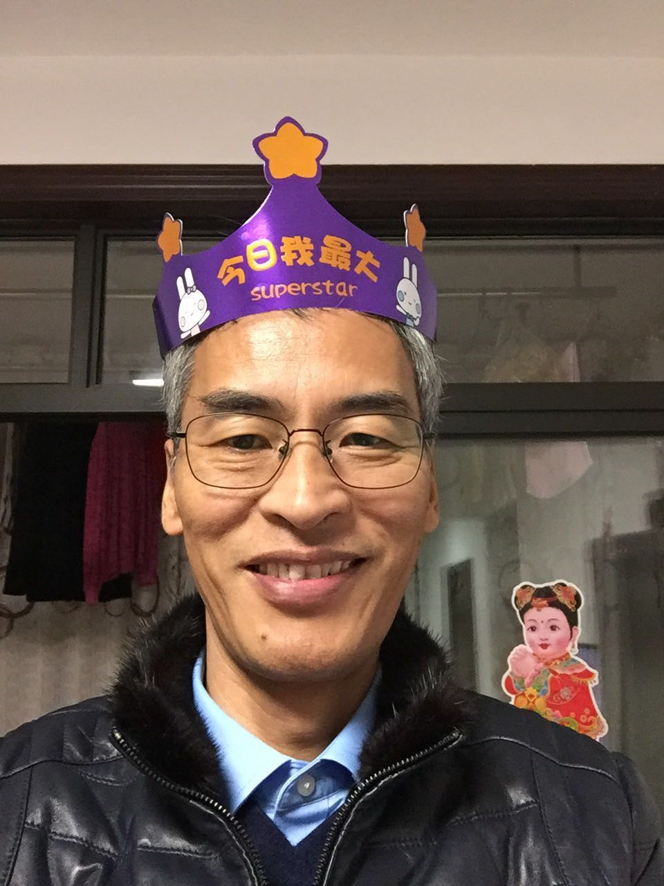

经历了满是折磨的一个星期，终于是迎来了reading week 可以歇一歇。估计是所有的老师都想在reading week之前赶完进度，所以很多作业都放到了这一周，好在是有两个老师考虑到了很多中国学生（亚洲人）可能要过新年，所以延长了两天的ddl
 - Feb 5: STAT443 Hwk2, PMATH450 Q4
 - Feb 9: PMATH451 A3
 - Feb 10: STAT443 Q3, AMATH250 Exam1, PMATH450 T1
 - Feb 12: AMATH 250 Oral Part 14:00, CO370 Hwk2
 - Feb 14: PMATH450 Q5,  CO463 A2 (12:15pm)

可惜的是，我最忙的那几天刚好就是除夕那几天，但好在提前做好了一些规划，才能抽出几个小时跟家人打一打视频电话。

国内除夕的早上，跟老爹打了个电话，今年很赶巧，他的生日和除夕刚好在同一天。爸妈那时候正准备去大伯那儿过年，我特高兴就是他俩气色和精气神都很好。每次跟他们聊天，我都觉得他们比我更有精力，更有朝气，甚至是更有生命力，好像他们的老去只能来自于身体，心灵上的老去则与他们无关。再看看我，虽然才21，但我已经不是很愿意去尝试新事物了。尤其是因为长时间的久坐以及缺乏运动，身体感觉也有些莫名其妙的毛病，腰疼，膝盖感觉都不灵活了，以至于更没有活力。倒是老爹，没事打打太极，打打牌，过得好不热闹。

之后一家人聚在了大伯家，我也有了机会跟所有人打打招呼，奶奶阿，大伯大妈， 姑姑姑爷，叔叔，还有各位兄弟姐妹。平时也没有机会跟他们聊天，主要还是找不到理由起这个头。各位的长辈的身体都不错，同辈里面倒是我看起来最老，可能数学是真的比较折磨人吧。看到他们，出国之前的日子就会浮现在脑海中，那个时候真的很轻松，没有什么好考虑的，只要每天就玩儿就好了，可惜现在不一样了，人长大了就不能只顾着玩耍，而是要承担越累越多与年龄对应的责任了，对于现在的我而言，责任恐怕就是好好学习吧。

爸妈在午饭之后便去了婆婆那，我也有了机会跟婆婆阿公讲话。外公的身体出乎意料的好，身上没什么病，也就是眼睛和耳朵不怎么好，好在眼睛装了晶体，耳朵也有助听器 （但是他不喜欢戴）。婆婆最近开始学着用微信了，学会了发红包和抢红包，哈哈。聊到一半她说要我好好读书，不要太记挂他们，我说当然要记挂了，怎么能不记挂呢？她略带抱怨地说，“记挂怎么也没看到你打电话回来”

今天就到此为止吧
